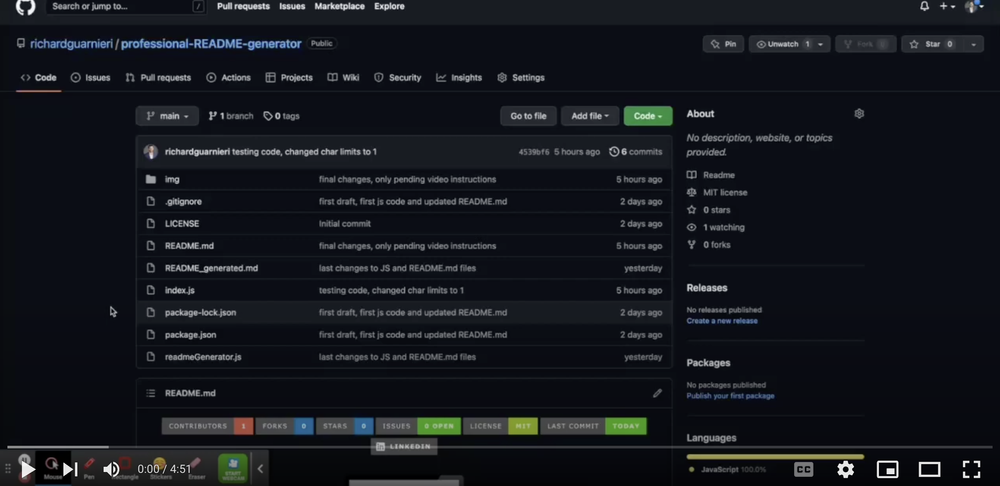

<!-- This template was created following The Markdown Guide - https://www.markdownguide.org/ -->

<!-- If you are editing this README.md on VS Code, please highlight and replace the following keywords enclosed in backticks (``) using:
* MacOS: CMD + Shift + L
* Windows: CRTL + Shift + L

GitHub Username: `richardguarnieri`
GitHub Repository: `professional-README-generator`
Your Name: `Richard Guarnieri`
Email: `richard.gm@outlook.com`
LinkedIn Username: `rguarnieri`
Twitter Username: `ric_guarnieri`
Project Title: `Professional README.md Generator`
Project Description: `A README.md generator for your projects!`
-->

<!-- Please also update the following links -->
[logo]: ./img/logo.png
[application-image]: ./img/app-image.png

<div id="home"><div> 

<!-- Badges / Shields -->
<!-- These were created using https://shields.io/ - feel free to replace / create yours by modifying links below: -->

<div align="center">
    <a href="https://github.com/richardguarnieri/professional-README-generator/graphs/contributors">
        
    <a>
     <a href="https://github.com/richardguarnieri/professional-README-generator/network/members">
        
    <a>
     <a href="https://github.com/richardguarnieri/professional-README-generator/stargazers">
        
    <a>
     <a href="https://github.com/richardguarnieri/professional-README-generator/issues">
        
    <a>
     <a href="https://github.com/richardguarnieri/professional-README-generator/blob/main/LICENSE">
        
    <a>
     <a href="https://github.com/richardguarnieri/professional-README-generator/commits/main">
        
    <a>
    <a href="https://www.linkedin.com/in/rguarnieri/">
        
    <a>
</div>
<br>


<!-- Header -->

<div align="center">
    <a href="https://github.com/richardguarnieri/professional-README-generator">
        
    </a>
    <h1 align="center">Professional README.md Generator</h1>
    <div>
        A README.md generator for your projects!
        <br>
        <a href="https://github.com/richardguarnieri/professional-README-generator">
            <strong>Explore Documentation</strong>
        </a>
        <br>
        <br>
        <a href="https://github.com/richardguarnieri/professional-README-generator">View Demo</a>
        ·
        <a href="https://github.com/richardguarnieri/professional-README-generator/issues">Report Bug / Request Feature</a>
    </div>
</div>
<br>


<!-- Table of Contents -->
## Table of Contents

* [The Project](#the-project)
    * [Technology Stack](#technology-stack)
* [Getting Started](#getting-started)
    * [Prerequisites](#prerequisites)
    * [Installation](#installation)
* [How to Use](#how-to-use)
* [Contributing](#contributing)
* [License](#license)
* [Contact](#contact)
* [Miscellaneous](#miscellaneous)
    * [User Story](#user-story)
    * [Acceptance Criteria](#acceptance-criteria)
<br>


<!-- The Project -->
## The Project

![Application Image][application-image]

This is a command-line application that will easily generate a README.md template, allowing creators to allocate more time to working on the project itself rather than on building README files. 

The project idea was driven by the huge amount of time invested in building README.md for individual projects, which after some time gets repetitive and most of us can agree time would be better allocated elsewhere. This problem makes for a quick automation via Node.js

<p align="right"> - <a href="#home">Return to Home</a></p>

### Technology Stack
* [Node.js](https://nodejs.org/en/)
* [inquirer](https://www.npmjs.com/package/inquirer)

<p align="right"> - <a href="#home">Return to Home</a></p>


<!-- Getting Started -->
## Getting Started
To get started you will need a couple of things - clear explanation of this below:

<p align="right"> - <a href="#home">Return to Home</a></p>

### Prerequisites
[Node.js](https://nodejs.org/en/) as we will need it to install the [inquirer](https://www.npmjs.com/package/inquirer) NPM package to execute the application.

The application will run on the command-line, meaning this will be the only requirement.

<p align="right"> - <a href="#home">Return to Home</a></p>

### Installation
In order to get started, we must first install Node.js - on macOS I prefer to install it using the Homebrew package manager and on Windows using the Node.js homepage download section.

**On macOS:**
1. To install Homebrew on macOS, browse to [Homebrew's official website](https://brew.sh/) and copy the link displayed on the page on the macOS terminal. At the time of writing, this is the command: 
```shell
/bin/bash -c "$(curl -fsSL https://raw.githubusercontent.com/Homebrew/install/HEAD/install.sh)"
```

2. Once Homebrew installation is complete, type the following command to install Node.js and NPM:
```shell
brew install node
```

3. Once the installation finishes, confirm that you successfully installed Node.js by checking its version:
```shell
node -v
```

**On Windows:**
1. In a web browser, navigate to https://nodejs.org/en/download/. Click the Windows Installer button to download the latest default version. At the time of writing, the latest LTS version is 16.15.0.

2. Execute the installer to install Node.js

3. Once the installation finishes, confirm that you successfully installed Node.js by checking its version:
```shell
node -v
```

<p align="right"> - <a href="#home">Return to Home</a></p>


<!-- How to Use -->
## How to Use
First, clone this repo via HTTPS in your local computer - feel free to use any storage destination / folder of your choosing. On macOS / Windows, open the CLI (Command Line Interface) and type the following command (ensure you are located in the exact directory where you want to clone the repo):

```shell
git clone https://github.com/richardguarnieri/professional-README-generator.git
```

After the repo has sucessfully cloned, navigate to the repo using the cd (chage directory) command:
```shell
cd professional-README-generator/
``` 

Once inside the professional-README-generator directory, install the necessary node pacakges to run the application - in order to do so, pls type on the CLI the following command:
```shell
npm install
```
Above command will install the [inquirer](https://www.npmjs.com/package/inquirer) NPM package along all its dependencies in a newly generated folder within the professional-README-generator directory called node_modules/

Once installation finishes, we are clear to execute the application. To do so, run the index.js file typing in the CLI the following command:
```shell
node index.js
```

After execution, the program will begin a series of 17 questions.

Answers to questions 1 to 11 are required to be longer than 5 characters (except 5 and 6) and answers to questions 12 - 16 (except 15) are required to be longer than 600 characters. The questions are:

1. What is your GitHub username? (required):
1. What is your GitHub repository name? (required):
1. What is your name? (full name) (required):
1. What is your email address? (required):
1. What is your LinkedIn username?:
1. What is your Twitter username?:
1. What is your project title? (required):
1. Please write a brief (no more than 60 characters) project subtitle (required):
1. Please write the relative path of your project image/logo (e.g. ./img/logo.png) (required):
1. Please write the relative path of the application image (e.g. ./img/app-image.png) (required):
1. Please write the application URL (e.g. https://example.com/) (required):
1. Provide a short description explaining the what, why, and how of your project (required):
1. What are the steps required to install your project? Provide a step-by-step description of how to get the development environment running (required):
1. Provide instructions and examples for use (required):
1. Please provide instructions on how other developers can contribute to the project (required):
1. Go the extra mile and write tests for your application. Then provide examples on how to run them here (required):
1. Please choose a license for your application (required):

Once you sucessfully answer all the questions, the automated **README_generated.md** file will be generated and appear in the same directory.

**If you'd like, you can also check this youtube walkthrough below that further explains how to use the app in less than 5 minutes:**

[](https://www.youtube.com/watch?v=IxaZtMH1J-o)

_For more examples, please refer to the [Documentation][documentation-url]._

<p align="right"> - <a href="#home">Return to Home</a></p>


<!-- Contribuiting -->
## Contributing
Contributions are much welcomed! If you have suggestions to make this application better, please fork the repo and create a pull request. 

You can also open an issue [here][github-issues-url] and tag it with the **"enhancement"** label.

<p align="right"> - <a href="#home">Return to Home</a></p>


<!-- License -->
## License
This project is licensed under the terms of the MIT license. 

See `LICENSE` for more information.

<p align="right"> - <a href="#home">Return to Home</a></p>


<!-- Contact -->
## Contact
Richard Guarnieri: richard.gm@outlook.com · LinkedIn: [rguarnieri][linkedin-url] · Twitter: [@ric_guarnieri][twitter-url]

<p align="right"> - <a href="#home">Return to Home</a></p>


<!-- Miscellaneous -->
## Miscellaneous
### User Story
```
AS A developer
I WANT a README generator
SO THAT I can quickly create a professional README for a new project
```

<p align="right"> - <a href="#home">Return to Home</a></p>

### Acceptance Criteria
```
GIVEN a command-line application that accepts user input
WHEN I am prompted for information about my application repository
THEN a high-quality, professional README.md is generated with the title of my project and sections entitled Description, Table of Contents, Installation, Usage, License, Contributing, Tests, and Questions
WHEN I enter my project title
THEN this is displayed as the title of the README
WHEN I enter a description, installation instructions, usage information, contribution guidelines, and test instructions
THEN this information is added to the sections of the README entitled Description, Installation, Usage, Contributing, and Tests
WHEN I choose a license for my application from a list of options
THEN a badge for that license is added near the top of the README and a notice is added to the section of the README entitled License that explains which license the application is covered under
WHEN I enter my GitHub username
THEN this is added to the section of the README entitled Questions, with a link to my GitHub profile
WHEN I enter my email address
THEN this is added to the section of the README entitled Questions, with instructions on how to reach me with additional questions
WHEN I click on the links in the Table of Contents
THEN I am taken to the corresponding section of the README
```

<p align="right"> - <a href="#home">Return to Home</a></p>


<!-- References, Links and Images -->
<!-- Badges / Shields Styles -->
[github-contributors-shield]: https://img.shields.io/github/contributors/richardguarnieri/professional-README-generator?style=for-the-badge
[github-forks-shield]: https://img.shields.io/github/forks/richardguarnieri/professional-README-generator?style=for-the-badge
[github-stars-shield]: https://img.shields.io/github/stars/richardguarnieri/professional-README-generator?style=for-the-badge
[github-issues-shield]: https://img.shields.io/github/issues/richardguarnieri/professional-README-generator?style=for-the-badge
[github-license-shield]: https://img.shields.io/github/license/richardguarnieri/professional-README-generator?style=for-the-badge
[github-last-commit-shield]: https://img.shields.io/github/last-commit/richardguarnieri/professional-README-generator?style=for-the-badge
[linkedin-shield]: https://img.shields.io/badge/-LinkedIn-black.svg?style=for-the-badge&logo=linkedin&colorB=555

<!-- Badges / Shields URL -->
[github-contributors-url]: https://github.com/richardguarnieri/professional-README-generator/graphs/contributors
[github-forks-url]: https://github.com/richardguarnieri/professional-README-generator/network/members
[github-stars-url]: https://github.com/richardguarnieri/professional-README-generator/stargazers
[github-issues-url]: https://github.com/richardguarnieri/professional-README-generator/issues
[github-license-url]: https://github.com/richardguarnieri/professional-README-generator/blob/main/LICENSE
[linkedin-url]: https://linkedin.com/in/rguarnieri

<!-- Non Badge / Shield Reference Links -->
[documentation-url]: https://github.com/richardguarnieri/professional-README-generator
[twitter-url]: https://twitter.com/ric_guarnieri